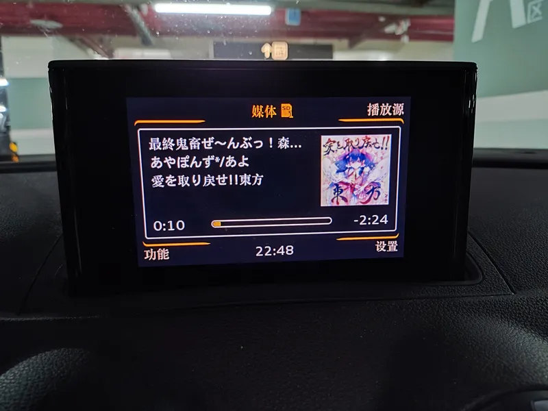

奥迪汽车多媒体交互系统 MP3 音乐文件封面修复
=======
## 功能
网易云音乐下的歌封面又大，位置又不是封面，就会导致车上放不起。

将 MP3 文件的图片全部缩小到不大于 480x480 ，位置调整到封面(Cover-Front)。

## 运行
本来 .Net Framwork 也能写，但是为了学习新技术，用了 .Net 6。

因为是个人用，所以懒得写传入参数了。只支持传入 mp3 文件路径。

## 使用开源库
* [IdSharp](//github.com/RandallFlagg/IdSharpCore)   .NET ID3 Tagging Library