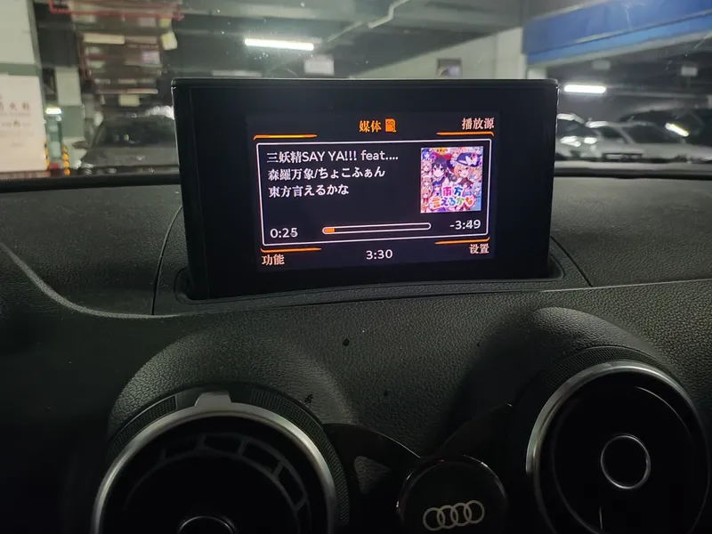
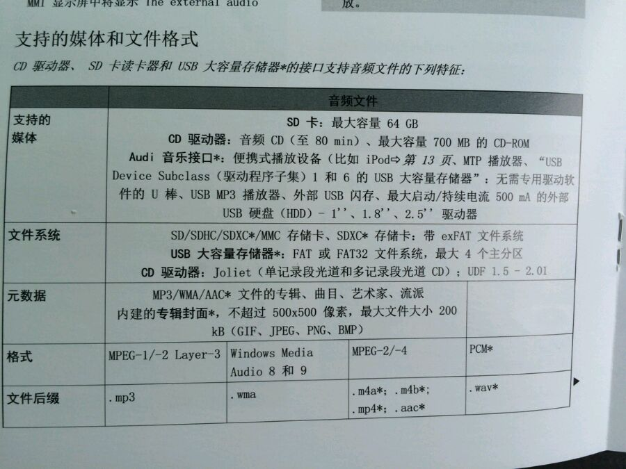

奥迪汽车多媒体交互系统 MP3 音乐文件封面修复<br>Audi Multi Media Interface MP3 Cover Repair
=======


此程序可以将 MP3 文件内嵌的第一张图片
* 调整大小（默认缩小到不大于 480x480）；
* 转为 JPEG 格式；
* 位置调整到专辑封面；
* 元数据版本设置为 ID3v2.3。

这样处理后，我的迪汽车多媒体系统就能正常显示封面了。

## 原理解析
我的奥迪汽车是 Audi A3 2014 年款，多媒体系统支持 MP3 和 M4A 音频。但是一些在线音乐平台下载的歌曲封面图片尺寸过大，或位置错误，就导致在我的车上不显示封面画面。

我自己测试发现，显示封面图片需要具备以下条件：
* MP3 格式音频（M4A 仅显示文字信息）
* 元数据格式版本为 ID3v2.3
* 图片位置必须位于专辑封面(Cover-Front)
* 图片尺寸 ≤ 499 × 499

以上是，另外[此文章](https://www.petenetlive.com/KB/Article/0001116)还提到文件大小需小于 254kb

翻出来我以前拍的一张手册的照片，显示了媒体支持的格式，和我的测试内容差不多。  


如果你的车型比较新，可通过[奥迪官方页面](https://ownersmanual.audi.com/home)获取说明书，不同版本车辆支持的图片大小不一样。

## 如何使用
由于使用 [System.Drawing.Common](https://learn.microsoft.com/dotnet/core/compatibility/core-libraries/6.0/system-drawing-common-windows-only) 处理图片，因此仅支持 Microsoft Windows 操作系统。
### v2.3 版本安装 .Net 8 运行时

示例
```bat
AMMICP.exe C:\music\a.mp3 "D:\music\good song.mp3" E:\a.mp3
```

也可以递归处理文件夹
```bat
AMMICP.exe "C:\music folder"
```

查看帮助信息可以获取更多可设置参数
```bat
AMMICP.exe -h
```

## 使用开源库
* [System.CommandLine](https://www.nuget.org/packages/System.CommandLine) - .NET CommandLine parser
* [Audio Tools Library (ATL) for .NET](https://www.nuget.org/packages/z440.atl.core/) - .NET ID3 Tagging Library